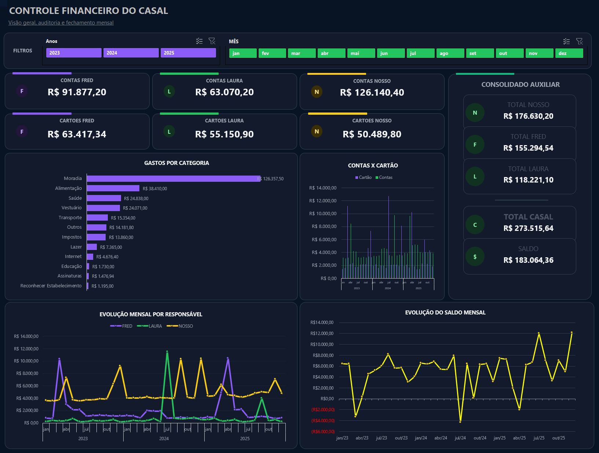

<div align="center">

# Controle Financeiro do Casal

### Financial Management System  
Excel • Power Query • Python • Data Modeling • Dashboard

Sistema financeiro desenvolvido para simular um fluxo real de organização, extração, tratamento e análise de dados financeiros, com base sintética e documentação voltada para portfólio em dados.



</div>

---

## Visão geral

Sistema financeiro desenvolvido em Excel para controle de contas, cartões, gastos compartilhados e análise mensal de um casal.

O projeto simula um fluxo real de dados financeiros: faturas e movimentações são tratadas por um extrator em Python, consolidadas em uma base estruturada e consumidas por uma planilha com Power Query, tabelas dinâmicas, regras de rateio e dashboard interativo.

A versão publicada utiliza dados sintéticos de 2023 a 2025, criados para representar a saída esperada do extrator de faturas, preservando a privacidade dos dados reais.

O objetivo do projeto é demonstrar organização de dados, automação, modelagem de regras de negócio, construção de dashboard, governança e documentação técnica aplicada a um problema real.


## Como testar em 3 minutos

1. Baixe ou clone este repositório.
2. Abra o arquivo `dashboard/controle-financeiro-casal-dashboard.xlsb` no Excel Desktop.
3. Se necessário, habilite o conteúdo/edição.
4. Use os filtros de **Ano** e **Mês** no Dashboard.
5. Valide se cards e gráficos mudam conforme o período selecionado.
6. Rode **Dados → Atualizar Tudo** para testar a portabilidade da base.

> O arquivo foi preparado para consumir a base sintética em `data/synthetic/` sem depender de caminhos locais do computador do autor.

## Principais funcionalidades

- Dashboard interativo com filtros por ano e mês.
- Separação entre **Contas** e **Cartões**.
- Regra de rateio para gastos compartilhados classificados como **Nosso**.
- Total do casal calculado sem duplicar valores compartilhados.
- Auditoria e fechamento mensal.
- Abas automatizadas para estabelecimentos e recorrências pendentes.
- Power Query portátil para consumo da base sintética.
- Extrator Python para transformar faturas PDF/CSV em planilhas estruturadas.
- Exemplos sintéticos de faturas para testar o extrator sem expor dados reais.

## Arquitetura resumida

```text
Faturas PDF/CSV sintéticas
        ↓
Extrator Python
        ↓
Planilhas de movimentações extraídas
        ↓
Base sintética consolidada
        ↓
Power Query + Tabelas Dinâmicas
        ↓
Dashboard financeiro
```

## Estrutura do repositório

```text
controle-financeiro-casal/
├── dashboard/                     # Arquivo Excel principal
├── data/synthetic/                # Base sintética consumida pelo Dashboard
├── examples/faturas-sinteticas/   # Faturas sintéticas para testar o extrator
├── src/                           # Código Python do extrator
├── docs/                          # Documentação do projeto
└── _docs_privado/                 # Backlog interno ignorado pelo Git
```

## Documentação

- [Guia de teste rápido](docs/guia-teste-rapido.md)
- [Arquitetura do sistema](docs/arquitetura-do-sistema.md)
- [Regras de negócio](docs/regras-de-negocio.md)
- [Estrutura da planilha](docs/estrutura-da-planilha.md)
- [Extrator de faturas](docs/extrator-de-faturas.md)
- [Relatório de desenvolvimento](docs/relatorio-desenvolvimento.md)
- [Teste do extrator com faturas sintéticas](examples/faturas-sinteticas/README.md)

## Tecnologias utilizadas

- Microsoft Excel
- Power Query
- Tabelas Dinâmicas
- Segmentadores
- Python
- Pandas
- pdfplumber
- Dados sintéticos

## Observação sobre dados

Nenhum dado financeiro real deve ser publicado neste repositório. As faturas e movimentações incluídas são sintéticas e servem apenas para demonstração técnica.
